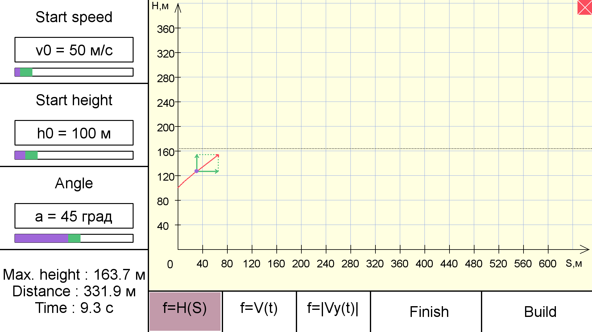

# BigThrow

## Desription
This school project is a program, that can build real-time graphs for a physical process,
known as "Ball is thrown at an alpha angle to horizon".

## Getting Started
### Necessary tools
To launch the program, make sure you have python 3 installed on your machine.
[Python 3](https://www.python.org/downloads/)

Also you must install pygame library. 
```
$ install pygame
```

### Launch
To launch the program
```
$ python bigthrow.py
```

### Simulating process and building graphs


You can set up your own parameters on the left panel. To start the simulation, press "Build" button. Also you can look at different graphs, pressing buttons on the 
bottom panel. If you your simulation is in progress, you can stop it anytime. Just press the "Finish" button. 
